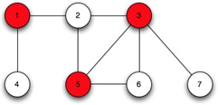

# Vertex-Cover
## Objective
Our aim is to help the local Police department with the installation of security cameras at traffic intersections. This is designed as the optimization problem called **Minimum Vertex-Cover** problem, where the idea is to minimize the cameras that needs to be installed for effective monitoring.
## Abstract
In this project, we have implemented three algorithms to solve the minimum vertex cover problem. The first algorithm CNF-SAT-VC is a polynomial time reduction to a CNF-SAT problem and the other two algorithms, namely APPROX-VC-1 and APPROX-VC-2, are approximate approaches. To analyse the algorithms' effciency , we collected the results from each algorithm and compared their mean running time as well as the approximate ratio. In conclusion, based on the data collected, APPROX-VC-1 turned out to be the best algorithm to solve the vertex cover problem.
## What is Minimum Vertex Cover
The minimum vertex cover is an optimization problem and it can be solved in polynomial time. Hence it is an NP complete problem. A vertex cover of an undirected graph is basically a subset of its vertices that covers all the edges of the graph. As an example, the red vertices shown in the figure below are part of the vertex cover.

## Getting Started
1. Install [CMake](https://cmake.org/download/) to build the executable file. 
2. You also need the Minisat SAT solver. It is available in this [repository](https://github.com/agurfinkel/minisat)

## Building and running the executables
1. Once you clone this repository into you directory of choice, run the following code in the terminal while you are in that directory

`mkdir build && cd build && cmake ../&&make`

This will generate a "make" file inside the "build" folder and the "make" command will build the executable.

#### Analysis
We have conducted a detailed analysis on the running time and approximate ratio of the three algorithms.
##### Running Time Analysis
We can compare the running time trends of APPROX-VC-1 and APPROX-VC-2. Both of them compute the results in far less time than CNF-SAT-VC, especially as V increases. APPROX-VC-1 takes more time because the algorithm searches for vertex with highest degree whereas APPROX-VC-2 has no conditions and randomly picks up the edges to add to the vertex cover. Hence time complexity of former is more than the latter.

##### Approximate Ratio Analysis
*Approximate ratio* is defined as the ratio of the size of computed vertex to the size of minimum sized vertex for the same graph. We know that CNF-SAT-VC computes the minimum sized or the optimum sized vertex cover, though not necessarily unique. So we find the approximate ratio of each algorithm with respect to the CNF-SAT-VC output. The approximate ratio of CNF-SAT-VC is 1, hence closer the approximate ratio of the approximate algorithms to 1, more optimum the result. The approximate ratio is inversely proportional to the correctness of the result i.e. greater the approximate ratio gives more inaccurate vertex cover.

Feel free to check out the comparisons and reasonings [here](https://github.com/nmariya/Vertex-Cover/blob/master/report.pdf)
